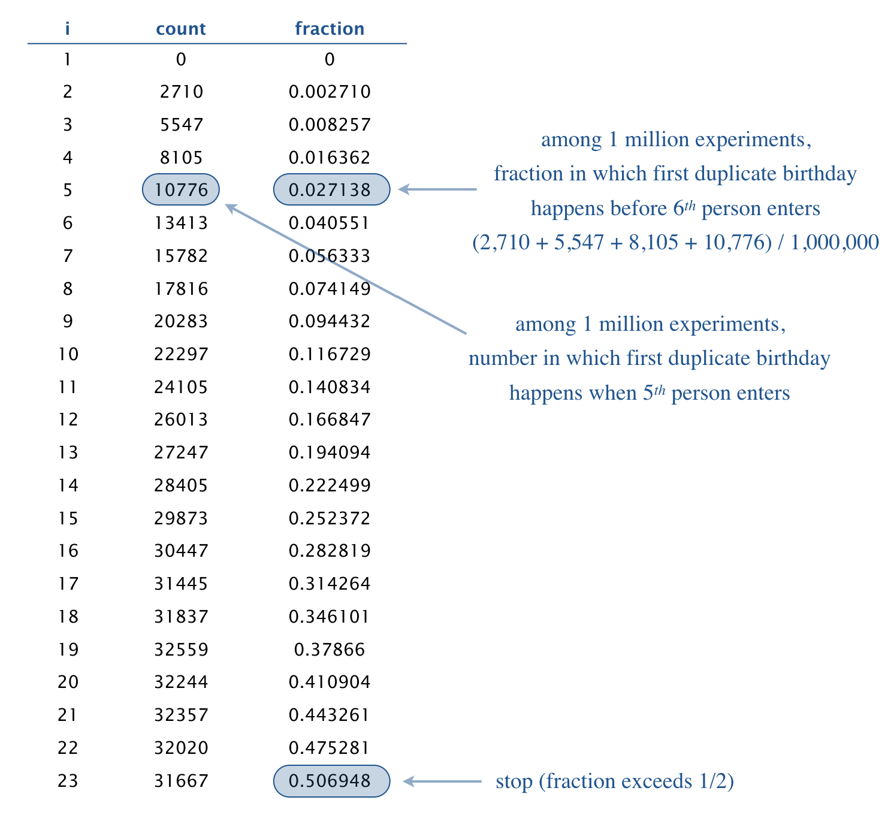

# Birthday Problem Simulation

This Java program simulates the famous birthday problem, demonstrating the counterintuitive probability that in a group of randomly selected people, two individuals will share the same birthday.

## The Birthday Problem

The birthday problem states that:
- People enter a room one at a time
- We want to know how many people must enter until two share a birthday
- Surprisingly, after just 23 people enter, there's approximately a 50% chance of a shared birthday

This phenomenon has important applications in computer science, including:
- Hashing algorithms
- Cryptographic attacks
- Random number generator testing

## Program Usage

Compile and run the program with:
```bash
javac Birthday.java
java Birthday n trials
```

Where:
- `n` is the number of possible birthdays (e.g., 365 for standard birthdays)
- `trials` is the number of experiments to run

## Example Output



```bash
~/Desktop/arrays> java Birthday 365 1000000
1   0       0.0
2   2710    0.00271
3   5547    0.008257
4   8105    0.016362
5   10776   0.027138
6   13413   0.040551
7   15782   0.056333
8   17816   0.074149
9   20283   0.094432
10  22297   0.116729
11  24105   0.140834
12  26013   0.166847
13  27247   0.194094
14  28405   0.222499
15  29873   0.252372
16  30447   0.282819
17  31445   0.314264
18  31837   0.346101
19  32559   0.37866
20  32244   0.410904
21  32357   0.443261
22  32020   0.475281
23  31667   0.506948

~/Desktop/arrays> java Birthday 31 1000000
1   0       0.0
2   32270   0.03227
3   62580   0.09485
4   87582   0.182432
5   105596  0.288028
6   114427  0.402455
7   115494  0.517949
```

## How It Works

For each trial, the program:
1. Chooses a birthday uniformly at random between 0 and n-1
2. Has that person enter the room
3. Checks if they share a birthday with someone already in the room
4. If yes, stops the trial; if no, repeats

After all trials, it prints a table showing:
- The count i (number of people in room)
- Number of trials where exactly i people entered
- Fraction of trials where i or fewer people entered

The table stops when the fraction reaches or exceeds 50%.

## Implementation

The program is implemented in `Birthday.java` and demonstrates:
- Command-line argument processing
- Random number generation
- Statistical simulation
- Tabular output formatting


License

This project is open-source under the MIT License.
